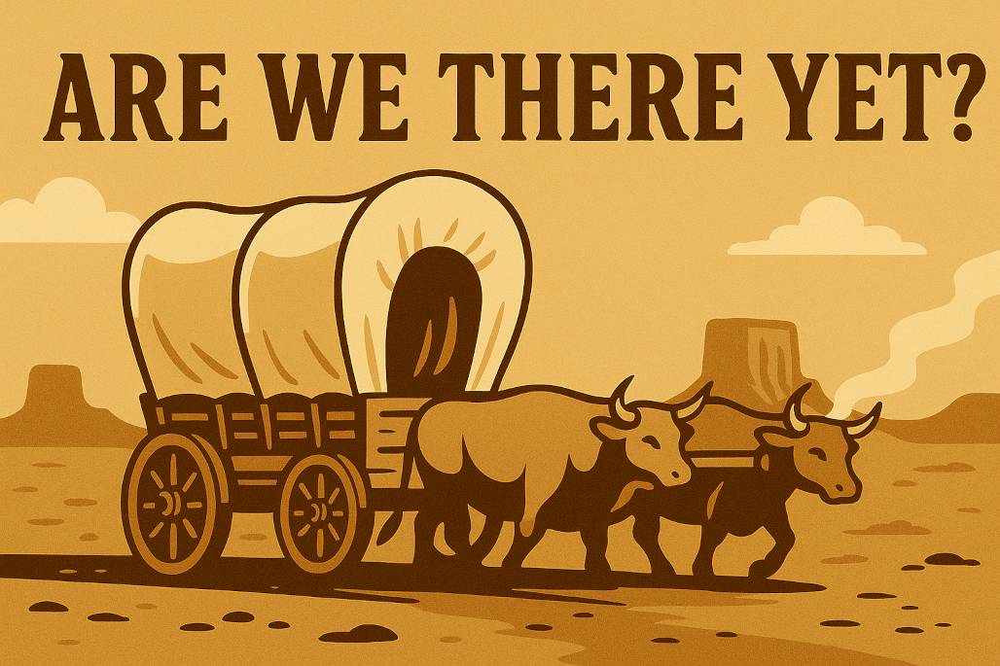

If you’ve ever played *The Oregon Trail*, you know the vibe. You set off full of optimism, the wagon’s creaking, the oxen are cooperative, and spirits are high. Then reality sets in. The river’s too deep, someone’s caught dysentery, and the map you printed turns out to be wishful thinking.

Shipping a VS Code extension, especially one powered by AI, feels a lot like that.  
You start with a plan and a promise. But the road? It’s longer.  
The ruts are deeper.  
And yes, someone’s always asking: *“Are we there yet?”*

<!-- truncate -->

## The Long Road to the Marketplace

That glowing “Publish” button in the VS Code CLI? It looks so simple. But getting there requires more than code and caffeine. You’ll need patience, persistence, and a checklist as long as the trail from Independence to Oregon City.

We didn’t just write one.  
We lived it.  
We rewrote it.  
And now we follow it like a wagon master who’s seen one too many broken axles.

Here’s what’s packed in our kit:

### 🧭 What’s in Our Wagon?

- **Responsible AI and Ethics:** Like packing food and water before heading into the desert, we make sure our AI doesn’t go rogue. That means testing for harmful or biased output, adding filters, and clearly signalling when a response comes from the model, not the human.

- **Robust Testing and Quality:** Wagon wheels break. So do features. We don’t roll out until the wheels are tight. That means unit tests, exploratory testing, edge case spelunking, and performance checks. Nothing gets loaded unless it can take a hit on the trail.

- **Documentation and Transparency:** Every journey needs a map. We make sure our README is useful, our screenshots honest, and our privacy policy legible without a law degree.

- **Accessibility:** Everyone deserves a spot on the wagon. We check keyboard access, screen reader support, high contrast themes, and anything else that ensures nobody gets left behind.

- **Manifest and Metadata:** Think of this as your packing list. Proper versioning, icons, keywords, categories, publisher ID. When the Marketplace scout comes riding past, we want to be clearly labelled, well-prepared, and ready to trade.

- **Legal, Compliance, and Support:** Nobody likes paperwork. But when you reach a checkpoint, it pays to be above board. That means licensing, usage policies, data handling, and a support email that doesn’t vanish like a ghost town.

- **Publishing Process:** The final river crossing. Publisher account? Check. Tokens? Set. Marketplace package? Verified. We make sure everything is in order before we shout “Westward ho!”

## The Journey Is the Point

We’ll be honest. We haven’t hit the finish line yet. The Marketplace is still just over the ridge. But we’ve learned this much; every item on the checklist is a promise to the people who’ll use what we’ve built.

We don’t cut corners.  
We don’t leave anyone behind.  
And we don’t mind taking the scenic route if it means arriving with all our wheels still turning.

So… are we there yet?  
Nope. But we’re close. And we’re travelling well.

**See you on the trail.**
