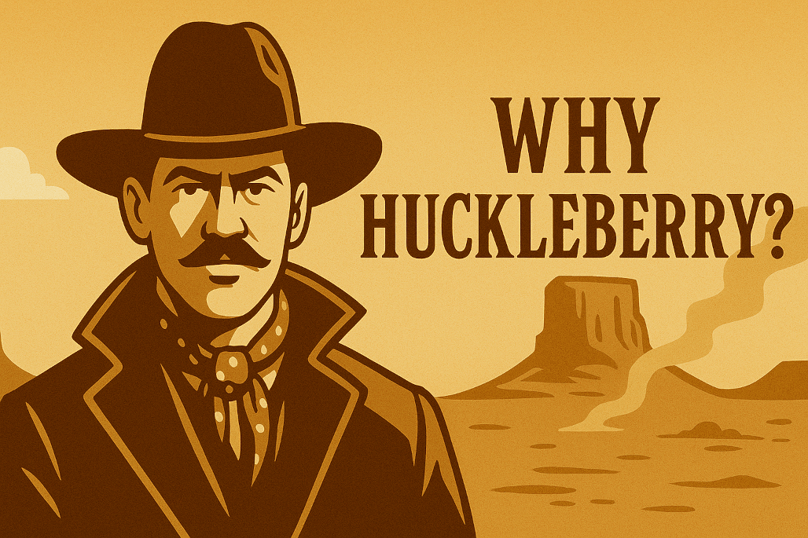

In *Tombstone*, Val Kilmer’s Doc Holliday delivers a line that hangs in the air like gun smoke:

> “I’m your huckleberry.”

It’s not a boast. It’s not a catchphrase. It’s a statement of intent.  
If this job needs doing, I’m the one who’ll do it.

According to Southern vernacular, a huckleberry was someone just right for the job. The person you call on when it’s time to get something done. Not flashy. Not loud. Just reliable, precise, and quietly confident. If there’s work worth doing, your huckleberry will be there. Coat off. Sleeves rolled. Toothpick optional.

That’s the energy we wanted for our VS Code assistant.

<!-- truncate -->

Huckleberry isn’t a chatbot. It’s not here for small talk or circular advice about semicolons. It’s an AI agent. A self-directed helper that can take meaningful action in your workspace.

You give it context, a task, maybe a bit of direction. It gets to work. Not just telling you what to do, but opening files, scanning TODOs, setting reminders, running code, surfacing bugs, and cross-referencing dependencies. It handles the background noise so you can focus on the signal.

## Why “Huckleberry” Works

There’s the cinematic reference, of course. Doc Holliday. Cool under pressure. Razor-sharp. Always in your corner when things get complicated.

There’s also the literary nod to *Huckleberry Finn*. The sidekick with a conscience. Loyal to the journey. Never hogs the spotlight. Just keeps the raft pointed in the right direction.

But mostly, it just fits. This project didn’t start as a moonshot or a manifesto. It started with a few too many TODO comments and not enough headspace to track them all. We wanted our tools to help. Not hover. To act. Not just advise.

Because a great coding assistant shouldn’t feel like a gimmick. It should feel like backup. The kind you trust to hold the line while you chase down a bug.

So next time you're staring down a tangled function at 4:43 on a Friday, wondering who's still in your corner...

**Huckleberry is ready.**  
Not flashy. Not fussy. Just someone who knows when to hold ’em and when to `git stash`.
